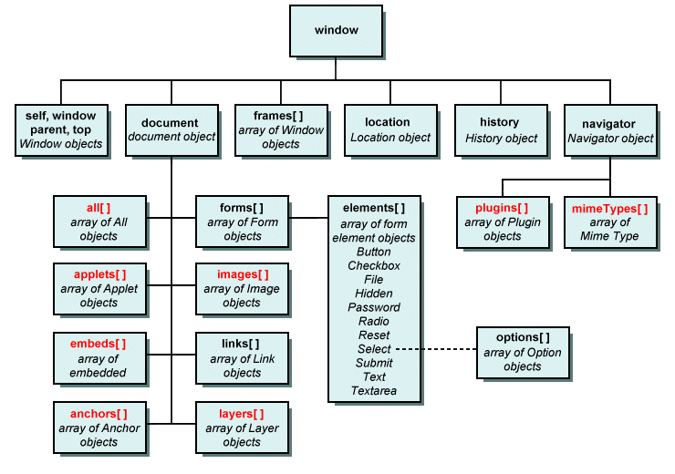

# Introducción a Javascript para navegadores web

Esta introducción a Javascript no pretende ser material detallado del lenguaje sino un resumen de modo introductorio a sus principales características y su aplicación en páginas web.
Vamos a mezclar conceptos del lenguaje con elementos propios de su funcionamiento dentro de un navegador.

##Qué es Javascript
Javascript es un lenguaje de programación que puede ser interpretado por los navegadores web de la actualidad, permite manipular todo el contenido de una página web a partir de su interacción con el [DOM](#las-páginas-web-y-dom) y las capacidades que le da AJAX.
Existen varias versiones del lenguaje vamos a concentrarnos en las características más comunes al día de la fecha.

Características más sobresalientes:

- [Tipado Dinámico](#tipado-dinámico): una variable puede tomar diferentes valores y tipos.
- Interpretado: no se compila, se interpreta mientas se ejecuta.
- [Basado en objetos](#objetos).
- Se utiliza principalmente en navegadores web si bien es posible hacerlo en otras plataformas.
- Tiene un pequeño número de objetos predefinidos.
- Se accede a las propiedades de los objetos como un [array asociativo](#arrays-asociativos) o con *.*
- Las funciones son objetos en sí mismo.
- Utiliza prototipos en lugar de clases para la herencia.
- Las funciones se pueden comportar como [constructores de objetos](#funciones-constructor).
- Estrcuturado, posee muchas de las estructuras de C
	- for
	- do
	- while
	- if
	- else
	- switch

##Cómo declarar una variable en Javascript?
````javascript
var nombre = "Leonardo";
````
La palabra var nos permite declarar una variable, nunca espeficamos el tipo sino que el mismo es inferido por el contenido, en este caso una cadena de texto.

Una vez declarada la variable se comporta según su tipo, es decir, podemos utilizar algunas de las funciones propias del tipo, por ejemplo:
````javascript
var nombre = "Leonardo";
nombre.indexOf("e");
````
En este ejemplo la función *indexOf* nos devuelve la posición de la letra *e* dentro de la variable.

##Herramientas de depuración e inspección
Los navegadores moderno nos dan la posibilidad de ejecutar Javascript en una consola y de hacer muchas de las tareas de depuración mediante alguna herramienta de desarrollo.
En IE, Edge, Firefox y Chrome podemos acceder mediante la tecla F12.
###El objeto console
Todos estas herramientas nos proveen de un objeto que se agrega a Javascript llamado *console* el mismo posee un grupo de funciones para imprimir dentro de la herramientas y algunas cosas más.
La que más vamos a usar es *console.log* que nos permite imprimir directo el valor de cualquier variable.

````javascript
console.log(nombre.indexOf("e"));
````

### Tipado dinámico
Podemos cambiar el valor de la variable *nombre* por supuesto, pero también podemos cambiar el tipo, por ejemplo:
````javascript
var nombre = "Leonardo";
console.log(nombre);
nombre = 123;
console.log(nombre);
````

Las funciones se comportan como variádicas, es decir, pueden recibir cualquier cantidad de parámetros.

````javascript
function concatenar(a, b, c){
	return a + b + c;
}

console.log(concatenar("hola ", "mundo"));
````

##Objetos
Es posible definir nuestros propios objetos en Javascript, para hacerlo hay dos formas.
###Funciones constructor
````javascript
function Persona(){
}
var pedro = new Persona();
console.log(pedro);
````

Esta función nos permite crear objetos haciendo uso de la palabra *new*.

Si quisiéramos que el objeto tuviera sus propiedad y métodos podemos hacer esto:
````javascript
function Persona(){
	this.nombre = "";
	this.edad = 0;
}

var pedro = new Persona();
pedro.nombre = "Pedro";
pedro.edad = 12;
console.log(pedro);
````

Otra forma de declarar objetos es la siguiente:

````javascript
var pedro = {
	nombre: "",
	edad:0
};
````
En este caso creamos el objeto y no podemos hacer new, la variable ya contiene el objeto.

###JSON

El útimo ejemplo de declaración de objetos utiliza un sintaxis especial de Javascript [llamada JSON](http://json.org/json-es.html) (Javascript object notation) y es de gran utilidad ya que podemos intercambiar estrucutras de datos completas utilizándola.

###Arrays asociativos

En realidad la utilización del *.* para llamar a los miembros de un objeto es *syntax sugar* (si bien es la más utilizada) la forma "normal" sería así:

````javascript
console.log(pedro["nombre"]);
````


##Las páginas Web y DOM
Cuando corremos Javascript dentro de un navegador buscamos interactuar con el contenido de la página para hacerlo necesitamos acceder a algo llamado *DOM* (document object model) y es una representación en memoria de todo el contenido de la página actual, es decir, el navegador recibe el HTML y a partir de él genera el DOM con su representación, la misma es un modelo de objetos.



